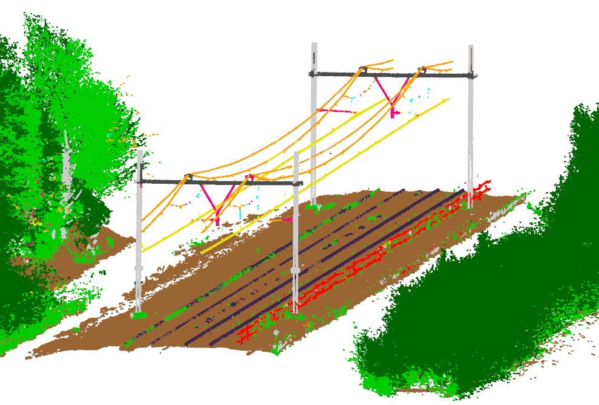
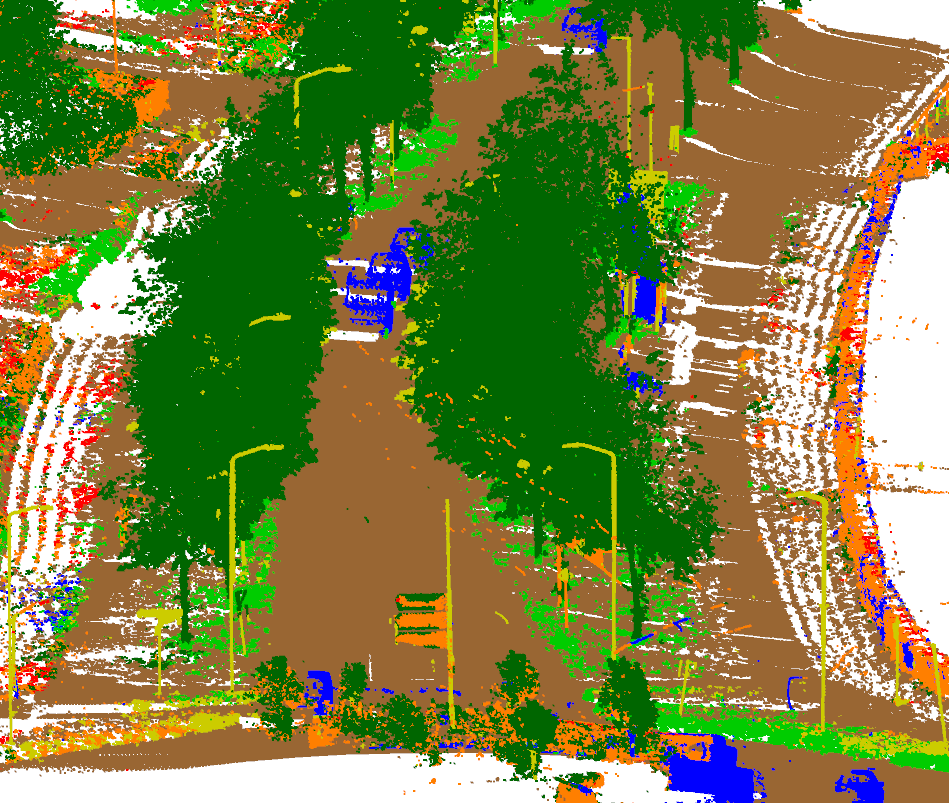
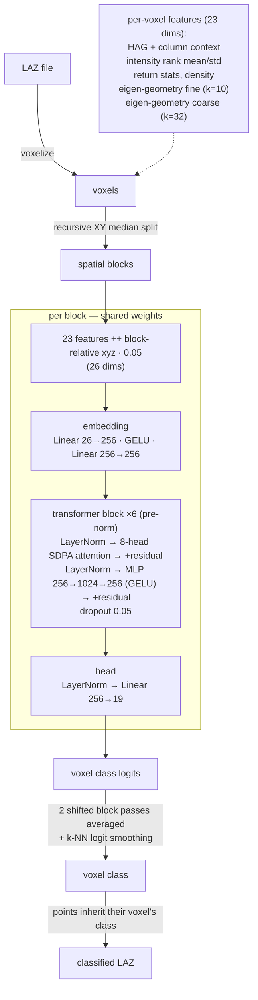

# HaiClass Voxel Transformer

Point cloud classification for point cloud data using a voxel
transformer. LAZ in, LAZ out, minimal dependencies, low VRAM usage.





## Setup

Setup assumes that `uv` is used as package manager.

```
uv sync
```

PyTorch comes from the cu128 index on Windows/Linux; on other
platforms it falls back to the default wheel (CPU / Metal on macOS). Edit `pyproject.toml` if you want another version of PyTorch.

## Usage

Paths, voxel size, and other parameters are defined in `config.py`. Training data must have the classification attribute set.

```

# 1. cache voxel features for the labelled training files
uv run python -m haiclass.precompute

# 2. train (checkpoints + metrics under runs\<run>)
uv run python -m haiclass.train --run vt01

# 3. classify the files in the input directory → out
uv run python -m haiclass.infer --run vt01

# 4. (optional) object segmentation: adds an instance_id extra dimension in place
uv run python -m haiclass.segment
```

`infer` skips files whose output already exists, so it can be re-run after an
interruption. Use `--files name` or `--limit N` for partial runs.

The classes that are to be used for object segmentation are defined in `segment.py`. Skip classes like ground here.

## Model architecture

The classifier is a plain transformer encoder that runs over voxels instead of
points or pixels. Each file is reduced to 0.10 m voxels; the voxels are grouped
into spatial blocks of ≤4096 by recursive median splits in XY, and every block
is processed independently with full self-attention (so each voxel attends to
every other voxel within a few tens of metres):



~4.8M parameters. Attention is standard scaled-dot-product (no CUDA-only ops),
so the same model runs on NVIDIA, AMD (ROCm) and Apple Metal backends; training
uses bf16 autocast on CUDA. Position is encoded by appending block-relative,
scaled xyz to the features — with random rotation/flip augmentation at training
time, and two shifted block partitions at inference to average away block-border
effects. Labels are learned per voxel (majority point class, cross-entropy with
1/log-frequency class weights).

## License
MIT license.
