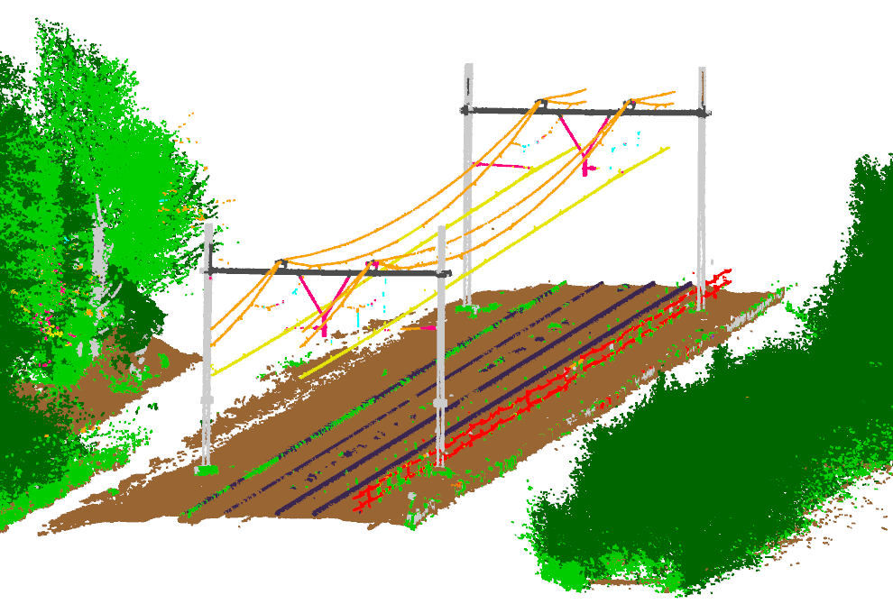
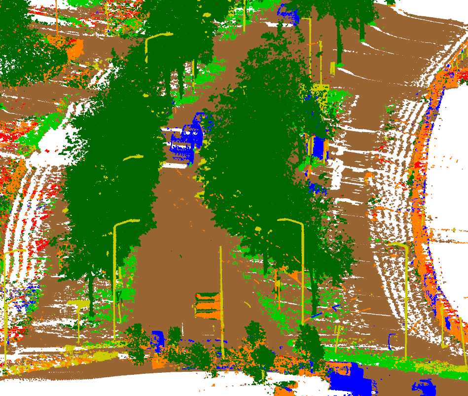
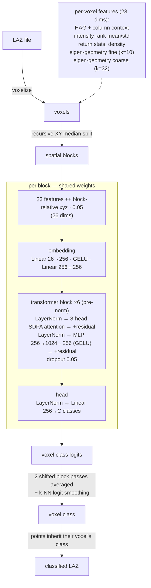

# HaiClass Voxel Transformer

Point cloud classification for point cloud data using a voxel
transformer. LAZ in, LAZ out, minimal dependencies, low VRAM usage.





## Setup

Setup assumes that `uv` is used as package manager.

```
uv sync
```

PyTorch comes from the cu128 index on Windows/Linux; on other
platforms it falls back to the default wheel (CPU / Metal on macOS). Edit `pyproject.toml` if you want a different version of PyTorch.

## Usage

Paths, voxel size, and other parameters are defined in `config.py`. Training data must have the classification attribute set.

```

# 1. cache voxel features for the labelled training files
uv run python -m haiclass.precompute

# 2. train (checkpoints + metrics under runs\<run>); --split-jitter 0.1 enables
#    jittered block splits (config default 0 = off), +4 mIoU on KITTI360
uv run python -m haiclass.train --run vt01 --split-jitter 0.1

# 3. classify the files in the input directory → out
uv run python -m haiclass.infer --run vt01

# 4. (optional) object segmentation: adds an instance_id extra dimension in place
uv run python -m haiclass.segment
```

`infer` skips files whose output already exists, so it can be re-run after an
interruption (`--overwrite` forces re-classification). Use `--files name` or
`--limit N` for partial runs.

The default paths come from `config.py`, but checkpoint, input and output can be
given directly — no run directory or `best.pt` needed:

```
uv run python -m haiclass.infer --model model_zoo/kitti360.pt --in /data/tiles --out /data/classified
uv run python -m haiclass.infer --model model_zoo/kitti360.pt --in /data/tiles/one.laz --out /data/classified
```

`--model` takes a checkpoint file (or a directory, in which case `--checkpoint`
names the file inside it); `--in` takes a directory of LAZ/LAS files or a single
file. Without `--model`, the checkpoint is still resolved as
`runs/<run>/<checkpoint>`.

The classes that are to be used for object segmentation are defined in `segment.py`. Skip classes like ground here.

## Model Zoo

- [KITTI360](model_zoo/kitti360.pt), trained with 0.2m voxel size. Val mIoU 51.3%.
- [KITTI360 v2](model_zoo/kitti360_v2.pt), trained with 0.2m voxel size and
  `--split-jitter 0.1` (jittered block splits). Val mIoU 55.5%, OA 92.3%.

Both KITTI360 models output the KITTI-360 benchmark class ids (2 road,
3 sidewalk, 4 building, 5 wall, 6 fence, 7 pole, 8 traffic light,
9 traffic sign, 10 vegetation, 11 terrain, 12 person, 13 car, 14 truck,
15 motorcycle, 16 bicycle), not ASPRS LAS classes.


## Model architecture

The classifier is a plain transformer encoder that runs over voxels instead of
points or pixels. Each file is reduced to `voxel_size` voxels (`config.py`; 0.20 m); the voxels are grouped
into spatial blocks of ≤4096 by recursive median splits in XY, and every block
is processed independently with full self-attention (so each voxel attends to
every other voxel within a few tens of metres):


```mermaid
flowchart TD
    tile["LAZ file"]
    feats["per-voxel features (23 dims):<br/>HAG + column context<br/>intensity rank mean/std<br/>return stats, density<br/>eigen-geometry fine (k=10)<br/>eigen-geometry coarse (k=32)"]
    vox["voxels"]
    blocks["spatial blocks"]

    tile -->|"voxelize"| vox
    feats -.-> vox
    vox -->|"recursive XY median split"| blocks

    subgraph perblock["per block — shared weights"]
        direction TB
        concat["23 features ++ block-relative xyz · 0.05<br/>(26 dims)"]
        embed["embedding<br/>Linear 26→256 · GELU · Linear 256→256"]
        enc["transformer block ×6 (pre-norm)<br/>LayerNorm → 8-head SDPA attention → +residual<br/>LayerNorm → MLP 256→1024→256 (GELU) → +residual<br/>dropout 0.05"]
        head["head<br/>LayerNorm → Linear 256→C classes"]
        concat --> embed --> enc --> head
    end

    blocks --> concat
    head --> logits["voxel class logits"]
    logits -->|"2 shifted block passes averaged<br/>+ k-NN logit smoothing"| vclass["voxel class"]
    vclass -->|"points inherit their voxel's class"| outlaz["classified LAZ"]
```

~4.8M parameters. Attention is standard scaled-dot-product (no CUDA-only ops),
so the same model runs on NVIDIA, AMD (ROCm) and Apple Metal backends; training
uses bf16 autocast on CUDA. Position is encoded by appending block-relative,
scaled xyz to the features — with random rotation/flip augmentation at training
time, and two shifted block partitions at inference to average away block-border
effects. Labels are learned per voxel (majority point class, cross-entropy with
1/log-frequency class weights).

## License
MIT license.
